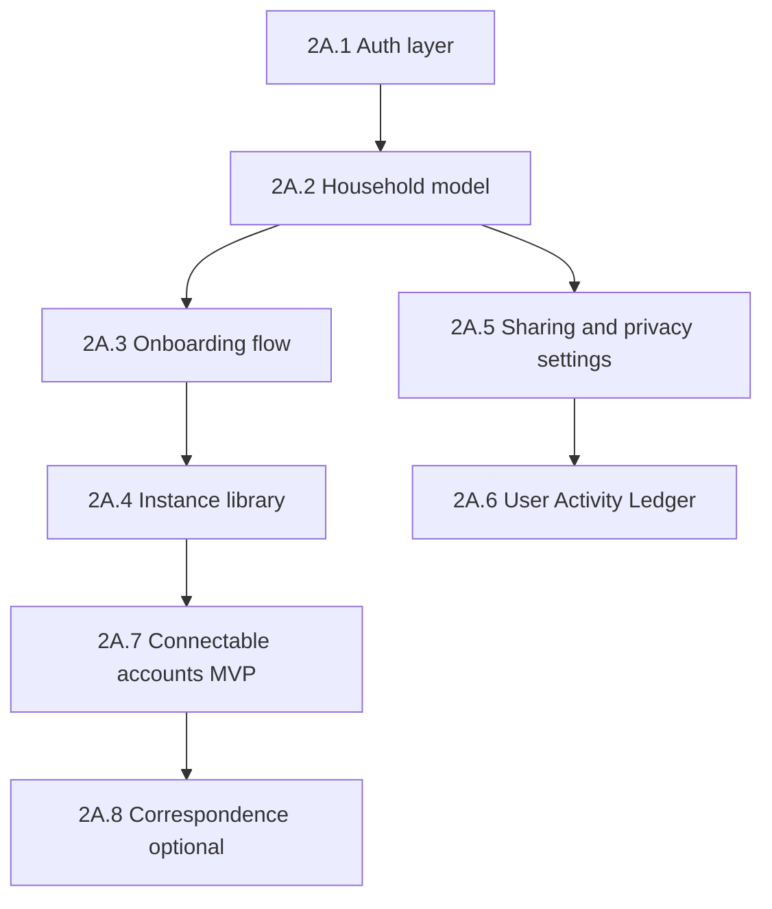

# TETHER — PHASE 2A: CONNECTION LAYER
## Implementation Plan

**Phase:** 2A — Connection
**Status:** Planned (next after Phase 1D basic complete)
**Depends on:** Phase 1A–1D (local-first app shell, modules, Family Hub, orchestration)
**Route map:** [`docs/route_map.md`](route_map.md) sections 21–23, build priority summary

---

## 1. GOAL

Move Tether from a single-device, local-first app to a **connected household** with accounts, sharing, and onboarding — without breaking offline use or privacy-by-default.

Phase 2A answers: *Who am I? Who is in my household? What can they see? How do I set up my instances?*

---

## 2. SCOPE (IN)

| Workstream | Deliverable | Route map reference |
|------------|-------------|---------------------|
| **Authentication** | Sign up, sign in, sign out, session restore, account profile stub | Settings user row; `main.dart` gate |
| **Household** | Create/join household, roles (owner, partner, teen, child profile, carer, viewer), invite flow (MVP) | `HouseholdScreen`, Family Hub `householdId` fields |
| **Connectable accounts** | Link partner/parent sync; per-item share toggles (UI + local model first) | Section 23 |
| **Instance library** | Browse role templates, add/swap instances (min 4, max 16) | `InstanceLibraryScreen` |
| **Onboarding** | Three tiers: Full Custom, Default Learning, Instance Growth | `OnboardingFlow` |
| **User Activity Ledger** | User-visible plain-English log of app actions | `UserActivityLedgerScreen` |
| **Sharing & privacy** | Settings tree for household roles, D1–D4 sensitivity, master toggles | `SharingPrivacySettingsScreen` |
| **Correspondence (Ellory)** | Basic handoff screen + draft review (optional slice if time) | Section 21 |
| **Ambient voice** | Deferred from 1C — wake word / ambient presence hooks | 1C deferral note |

---

## 3. OUT OF SCOPE (2B OR LATER)

- Cloud Resource Library (see [`cloud_resource_library_spec.md`](cloud_resource_library_spec.md))
- Full Support Preset per-toggle configure UI
- Blind/Low Vision accessibility suite
- Full Health/Repro/MH condition categories
- DV/coercive-control tooling (🔴 on hold)
- Marketplace, cross-platform sync, family plan (Phase 4+)

---

## 4. CURRENT CODEBASE ANCHORS

Existing fields and stubs to extend — **do not duplicate**:

| Area | Current state | File(s) |
|------|---------------|---------|
| Household ID on tasks/events | `householdId: 'default'` hardcoded | `lib/models/task.dart`, calendar services |
| Person profiles | `profileType`, `listKind` (family vs contact) | `lib/models/person.dart` |
| Settings auth placeholders | "Sign out arrives with authentication (Phase 2A)" | `lib/screens/settings/settings_screen.dart` |
| Module registry | Active modules drive bottom nav | `lib/providers/module_registry_provider.dart` |
| Ghost log (dev) | Exists from 1A — separate from user ledger | per `ghost_log_audit_spec.md` |
| Instance grid | Live instances on dashboard | dashboard + instance providers |

---

## 5. RECOMMENDED BUILD ORDER

### 2A.1 — Authentication layer
- Choose auth provider (Firebase Auth, Supabase, or custom backend — **decision required**)
- `AuthProvider`: signed-in user, session stream, sign out
- Gate `main.dart`: first launch → onboarding; returning → dashboard
- Wire Settings profile row and Sign out

### 2A.2 — Household model
- `households` table + `household_members` (user_id, role, person_id link)
- Replace `'default'` householdId with real ID from provider
- `HouseholdScreen`: create household, invite code/link (MVP), member list
- Map Family Hub people to household members where appropriate

### 2A.3 — Onboarding (three tiers)
- **Full Custom:** user picks modules + instances manually
- **Default Learning:** pre-named instances (Val, Tim, Viva, Rae, Ellory…), editable later
- **Instance Growth:** instances adapt over time (lightweight — prefs + suggestions first)
- Persist onboarding completion flag; skip on subsequent launches

### 2A.4 — Instance library
- Template catalog (Schedule, Oversight, Correspondence, +1)
- ➕/⛔️ add/swap with domain configuration
- Enforce min 4 / max 16 instances
- Link to existing instance grid and personalisation screen stub

### 2A.5 — Sharing & privacy settings
- Per [`settings_spec.md`](settings_spec.md) Phase 2A rows
- Roles: owner, partner/adult, teen, child profile, carer, viewer, emergency contact
- D1–D4 data sensitivity labels on share toggles
- Private by default; master toggle per relationship
- Teen graduated privacy rules (document; implement basic age gate)

### 2A.6 — User Activity Ledger
- New `activity_ledger_entries` table (timestamp, actor, action, data_used, shared_with)
- Hook orchestration / instance actions to append plain-English entries
- `UserActivityLedgerScreen` in Settings
- Distinct from developer Ghost Log (never user-facing)

### 2A.7 — Connectable accounts MVP
- Partner sync: shared calendar/tasks visibility toggles (read models first)
- Parent sync / sibling sync: stub UI with local prefs
- No cloud sync until backend choice is made — **local share intent model** ships first

### 2A.8 — Correspondence (optional slice)
- Ellory handoff card, single draft, Approve / Edit / Different version
- Android Share Sheet integration if platform allows in timeframe

---

## 6. DATA & MIGRATION

- DB version bump (v11+) with:
  - `households`, `household_members`
  - `activity_ledger_entries`
  - `share_permissions` (granular toggles)
  - `onboarding_state`
- Migrate existing `householdId: 'default'` rows to user's first household on first sign-in
- D4 data (crisis plans, panic logs, hidden notes): stricter share defaults, excluded from summaries

---

## 7. ACCEPTANCE CRITERIA

- [ ] New user can sign up, complete onboarding (any tier), land on dashboard
- [ ] Returning user session restores without re-onboarding
- [ ] Household created; at least one other member inviteable (MVP)
- [ ] Instance library: add/swap instance; min 4 enforced
- [ ] Settings → Sharing & Privacy shows role-based toggles (local model)
- [ ] Settings → User Activity Ledger shows recent plain-English entries
- [ ] Sign out clears session and returns to auth screen
- [ ] Offline: app remains usable for local data; sync conflicts deferred to 2B+

---

## 8. OPEN DECISIONS (RESOLVE BEFORE CODING)

1. **Backend / auth provider** — Firebase vs Supabase vs custom (affects household sync timeline)
2. **Invite mechanism** — email link, code, or QR for MVP
3. **Teen privacy** — age threshold and graduated visibility rules
4. **Correspondence** — in 2A core or 2A stretch goal

---

## 9. TEST PLAN

- Unit: household role permissions, share toggle defaults (D4 never shared by default)
- Widget: onboarding flow completion, instance library add/swap
- Integration: auth gate → onboarding → dashboard; ledger entry on orchestration event
- Manual: two test accounts, invite join, verify share toggle affects visibility (when sync exists)

---

## 10. REFERENCES

- [`docs/route_map.md`](route_map.md) — sections 21–23, build priority
- [`docs/settings_spec.md`](settings_spec.md) — Phase 2A settings rows
- [`docs/family_hub_spec.md`](family_hub_spec.md) — people, household context
- [`docs/ghost_log_audit_spec.md`](ghost_log_audit_spec.md) — developer log vs user ledger
